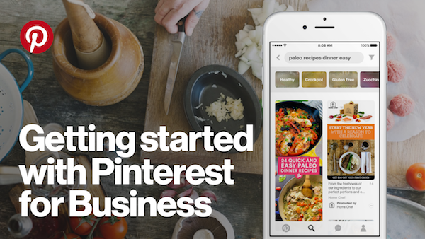
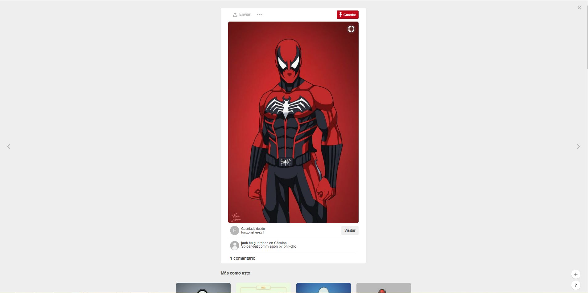

# **Reto UX n°1 | Pinterest**

-----------------------------
-----------------------------



## **Objetivo**

El objetivo de este reto es escoger una de las 3 páginas dadas en el LMS (en este caso ```Pinterest```) e indicar qué partes conforman el UX y qué partes el UI, fundamentando mis respuestas.

## **Análisis de Pinterest**

### **Partes UX**


- Poder obtener pines (imágenes) relacionados a una palabra clave (por ejemplo: anime) mediante el cuadro de búsqueda. Esto es una parte UX porque permite a los usuarios que buscan pines relacionado con un tema o pines sobre algo en concreto, 'investigar' y obtenerlo fácilmente.
- Poder obtener pines relacionados a los temas que le gusten o a lo último que ha estado viendo, accediendo a la sección Inicio(Por defecto, apareces allí al entrar a tu cuenta). Esto es en el caso que el que ingresa no sea un nuevo usuario. Cuando un usuario recién se crea su cuenta, le muestra imágenes de cualquier tema en general (Esto se debe, a que no se sabe cuáles son sus gustos. Cuando el usuario ya tiene tiempo usando esta página, evaluando la data sobre lo que este ve, se le puede asignar en Inicio pines relacionados a lo que ve más frecuentemente.)
- Darle la opción al usuario de si quiere habilitar alguna herramienta(en este caso relacionada a las notificaciones de su escritorio) o no. Esto es UX, ya que no fuerzas al usuario a aceptar una nueva herramienta que tal vez a él o ella no le interesa y así permites que use la página cómodamente.
- Cabe resaltar que el botón Habilitar destaca con su color de fondo para que resalte y el usuario centre su vista en esa opción .
- El ícono de Pinterest. El cual al hacerle click, envía al usuario a la página principal(sección de Inicio) desde donde sea que esté. También, lo considero que es una parte UX porque al tener los colores característicos de Pinterest, permite que los usuarios reconozcan, retengan y se les quede grabado en su mente(cerebro)la marca de Pinterest.


- Para los usuarios que les gusta explorar páginas web por su cuenta, tienen la sección Explorar para ver los diferentes pines en Pinterest(Existen usuarios que les gusta explorar por su cuenta y otros 'investigan', es decir, de frente se van al cuadro de búsqueda a buscar lo que desean).


- En la sección Explorar, también hay filtros predefinidos(elemento de navegación facetada) y se muestran las últimas tendencias según el filtro(debajo del menú de filtros), así como los pines relacionados al filtro en general(ver pines en la zona inferior de color de fondo gris claro). Estas son partes UX, porque le permiten a los usuarios explorar por su cuenta fácilmente y los filtros le sirven de guía para que vea temas generales que le pueden interesar y dentro de estos temas generales ver subtemas o temas específicos.
- Otra cosa a destacar es el menu de navegación(está encerrado en un rectángulo rojo), el cual es un elemento de navegación de tipo global ya que aparece en todas las páginas de Pinterest como se puede ver(es persistente), algo característico de este tipo de navegación.


- Poder saber en qué parte estás, gracias al estilo negrita aplicado en la sección dónde estás o cuando ingresas a tu perfil. Esto le sirve al usuario para orientarse, ya que en una página web es fácil perderse, al no tener límites de espacio.
- Tener un área de notificaciones para que el usuario vea quiénes le siguen, tableros(colecciones de pines) o pines que le puedan interesar, los que han guardado sus seguidores o a quiénes sigue. Esto sirve para que este al tanto de las últimas novedades que hay o que ven otras personas y para que encuentre cosas interesantes que hagan que siga utilizando la página.
- Tener una bandeja de entrada donde recibir mensajes o enviar mensajes. Esto es muy importante ya que el ser humano es un ser social y la bandeja de entrada le permite socializar con otras personas que compartan sus gustos.


- Tener utilidades como el perfil de usuario o la configuración, términos y privacidad, etc. (Cabe destacar que estás últimas utilidades están encerradas dentro del conocido ícono de 3 puntos suspensivos, el cual da a entender que hay más opciones por ver). Esto es UX, porque le permite al usuario, en cuanto a las utilidades, estar informado(ejemplo: términos y privacidad) o editar, hacer algo no relacionado con el contenido de la página(ejemplo: configuración).


- Asimismo le permite al usuario tener un lugar personalizado(perfil) dentro de esta página donde puede crear pines, tableros, observar lo que guardó, ver cantidad de pines en total, agregar notas o fotos a sus pines o a los de otros (ver sección del perfil probado). Además, esto permite que el usuario no tenga que estar descargando las imágenes para guardar sus fotos, sino que las puede guardar allí mismo y se ahorra el problema de la falta de espacio en su PC o laptop, así como puede agrupar lo que le guste según cierto tema y lo puede buscar fácilmente cuando lo desee, entre otras cosas.



- Al hacer click a un pin, se accede a este y se tiene la opción de enviarlo al correo, a alguna persona o compartirlo en redes sociales, comentar sobre este pin, visitar la página de dónde se ha obtenido el pin, acceder(con solo un clic) al perfil del que creó o subió este pin o al tablero al que pertenece (las letras de ambos están con estilo negrita y son de un tono gris más fuerte para que resalten). Considero que esto es UX, porque permite que el usuario comparta lo que le guste en sus redes sociales o con algún amigo(socializar), vea perfiles de otras personas y almacene pines que estas tengan, etc.


- El usuario también puede guardar pines en tableros propios, lo que le da el beneficio de almacenar imágenes sin necesidad de descargarlas, crear colecciones de pines a su gusto para poder buscarlas mejor según un tema, etc.
- Notificación de que ya has almacenado un pin. Esto definitivamente es una parte UX, porque soluciona un problema frecuente: el guardar imágenes que ya vistas. Muchas veces sucede que el usuario ve tantas imágenes que se puede olvidar que una de ellas ya la ha visto y la almacena o descarga otra vez y cuando va a su carpeta o al lugar donde la almacenó observa que hay 2, o a veces más imágenes iguales. Con esta notificación, puedes ahorrar tiempo (ya que cuesta dar un poco de tiempo para borrar imágenes repetidas) y espacio en tu computadora o en tu tablero.
- Asimismo en la notificación, se puede observar que hay un elemento de navegación inline(ver texto de color rojo con estilo negrita), el cual te dirige al pin donde guardaste esa imagen. Esto sirve para comprobar o si al usuario quiere revisar ese tablero.


- Debajo de la imagen anterior, se encuentra un elemento de navegación contextual, ya que da sugerencias/recomendaciones de otros pines relacionados con el pin que se visualiza(en este caso se muestran personajes de cómics). Esto es una parte UX, ya que se le brinda al usuario la oportunidad de que vea otros pines que le pueden interesar y que lo haga seguir navegando en Pinterest.


- Tener la opción de editar cuánto se puede ver de un pin(aunque no pertenezca al usuario) y además obtener pines relacionados al que se ve(navegación contextual). Para no repetir lo dicho arriba, sólo diré que considero que es una parte UX de Pinterest porque permite que el usuario almacene un pin y que se pueda ver solo cierta parte que él/ella desee, ya que puede usarlo para diferentes cosas. Ejemplo: Tal vez necesita una imagen con menos espacio para su foto de perfil de Facebook y por eso solo puede seleccionar parte de este pin.


- Poder hacer más cosas como subir pines propios, guardarlos desde un sitio web o adquirir actualizaciones. Esto es UX, ya que es útil para el usuario por si quiere guardar en Pinterest una imagen de un sitio web en vez de descargarla, si se ha perdido de alguna herramienta nueva o tal vez este usuario es un diseñador gráfico y tiene sprites o imágenes que quiere publicar para que varias personas la vean y/o la utilizen, entre otros cosas.


- Poder pedir ayuda al Centro de Asistencia de Pinterest por si hay algun problema con la cuenta, ver historial de pedidos, contactar con algún experto de esta página, etc. Esto es UX, porque le permite al usuario resolver problemas que tenga con la página, pidiendo ayuda en caso de que no pueda resolver algo por su cuenta o algún problema grave. Asimismo, hay varios elementos de navegación inline que dirigen a diversas páginas según el motivo del usuario (Por ejemplo: si eres un desarrollador web y quieres trabajar con Pinterest para construir un app o simplemente que la gente guarde las imágenes de tu página web mediante Pìnterest puedes lograrlo haciendo click en desarrolladores).

### **Partes UI**


- Colores de fondo. Son partes UI, porque los colores, en general, forman parte del diseño visual de una página. El UI Designer utiliza colores de fondo para contrastar con los colores de las letras para distinguir algún elemento de la página por diferentes motivos. También cuando se quiere hacer algún efecto. Por ejemplo: al pasarle el mouse sobre el ratón a un elemento, su color de fondo se vuelve de blanco a un gris intermedio. Así se puede ver que se está sobre ese elemento.


- Color, estilo, tamaño y fuente de letra. En Pinterest, estos factores varían según la jerarquía que tengan los elementos y qué elementos se quieren destacar; exceptuando la fuente de letra que es la misma para todos los elementos. Los considero parte UI de Pinterest, ya que permiten en el caso de la fuente de letra al ser la misma, dar uniformidad y no distraer la mirada de lo principal: las imágenes.

- En el caso del color de letra, es una parte UI ya que se busca, con las diferentes tonalidades grises que tienen, resaltar o opacar ciertos elementos, permitiendo visualmente distinguir o 'ignorar' ()no darle mucha importancia) a elementos. Los tonos más oscuros son usados para resaltar títulos o para guiar al usuario donde se encuentra(sección Inicio), los grises intermedios para destacar algo ligeramente del resto de elementos, pero no tanto como los elementos de tonos grises más oscuros (las descripciones de las imágenes o de quién publicó la imagen). Y por último los tonos grises más claro, los cuales se usan para que los elementos se distingan del color de fondo blanco, pero no resalten tanto para no opacar los que sean más importantes(las secciones y utilidades que están en la parte derecha del menú de navegación).


- Solo los textos dentro de las imágenes tienen color de letra blanco.

- En el caso del estilo de letra negrita, es una parte UI porque permite distinguir a los elementos más importantes(títulos, subtítulos, sección dónde te encuentras, etc.) de los menos importantes(secciones donde no estás, descripciones de las imágenes, etc.).

- En el caso del tamaño de letra, es parte UI ya que permite distinguir visualmente la jerarquía que tienen los elementos de la página.


- Colores de letra y fondo, y tamaños de los íconos. Los íconos son en sí parte UI, ya que forman parte del diseño visual de la página. Con sus diferentes tamaños, colores de letra y/o de fondo se busca que se distingan visualmente. Los colores de los íconos son generalmente de diferentes tonos grises, exceptuando:

- El ícono de Pinterest. Este tiene color de letra blanco con color de fondo rojo (colores característicos de Pinterest). 

- Los íconos que se encuentra en los pines generalmente son blancos.

- En cuanto al tamaño de estos, varían según donde sean contenidos.

- Hay íconos que representan marcas (ver imagen).

- Diseño de los botones(y los botones en sí). Esto lo considero parte UI, ya que los botones dan interacción a la página. Asimismo, el darle diseño a los botones los resalta y permite que se les pueda identificar como botones dentro de una página. Este diseño puede variar, pero los brtones Guardar se destacan por ser de color rojo y el texto que contiene es blanco. 

- El borde redondeado de los pines. Le da estética a las imágenes y permite que se aprecie visualmente.

